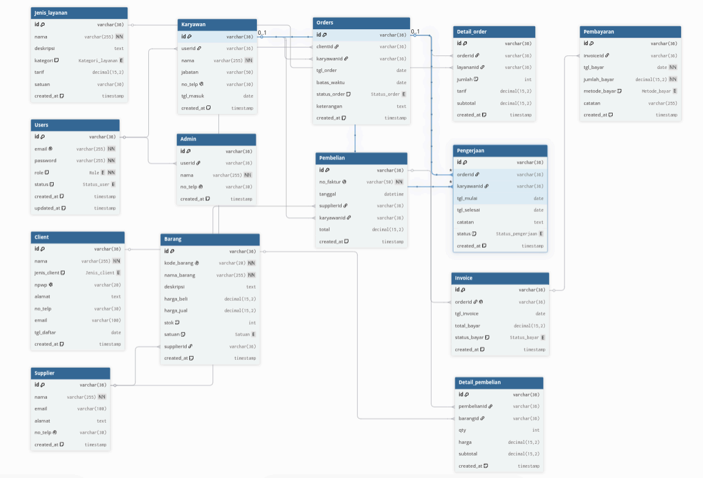

# Aplikasi-cv-metramoelyatama
Project ini di buat untuk memenuhi tugas matakuliah pemrograman visual

#Flow Aplikasi
Terdapat 2 role (Admin, Karyawan)
Masing-masing memepunyai hak akses yang berbeda
Admin: Dapat akses semua menu Table Master(Client, Karyawan, Supplier, Jenis Layanan, Barang), Table Transaksi(Orders, Pengerjaan, Invoice, Pembelian, Pengerjaan)
Laporan(Pembelian, Order, Pengerjaan, Invoice, Keuntungan)
Karyawan: Depat akses ke semua menu kecuali, Table(Karyawan, Invoice, Pembelian) dan Laporan Keuntungan

flow utama aplikasi ini yaitu: Admin atau karyawan -> Client -> Orders -> Pengerjaan, setelah itu (Admin) -> Invoice dan (Admin) -> Pembelian Barang

## Anggota Kelompok
- Reno Faza Givaro (202343501362)
- Rafli Mulya Hananta (202343501356)
- Muhammad Kemal Ramadhan (202343501402)
- Athiya Shafa Habibah (202343501385)
- Novalia Fitri Listiani (202343501397)
- Salma Apeliah (202343501363)
- Sinta Anggraeni Puspita Dewi (202343501360)
- Rachel Adelia Siburian (202343501355)

## ERD Database
